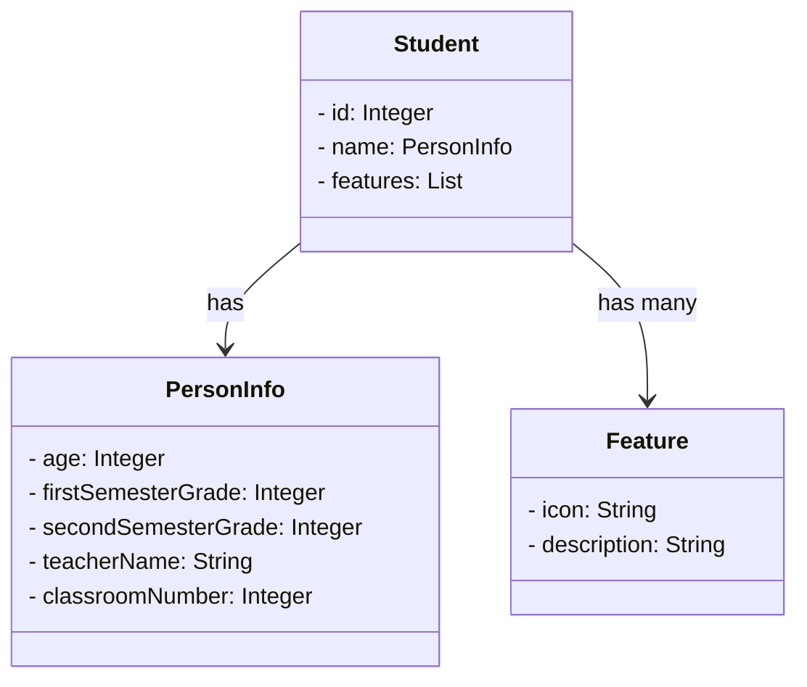

# API Restful Generation

## Diagrama de Classes 

```mermaid
classDiagram
    class Student {
        - id: Integer
        - name: PersonInfo
        - features: List<Feature>
    }

    class PersonInfo {
        - age: Integer
        - firstSemesterGrade: Integer
        - secondSemesterGrade: Integer
        - teacherName: String
        - classroomNumber: Integer
    }

    class Feature {
        - icon: String
        - description: String
    }

    Student --> PersonInfo: has
    Student --> Feature: has many
```
